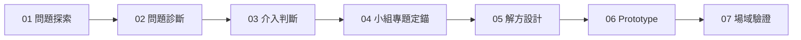

# capstone-course-design

Capstone 專題能力導向課程設計

## 課程核心流程

```
問題探索 → 問題診斷 → 介入判斷 → 小組專題定錨 → 解方設計 → Prototype → 場域驗證
```



| 階段 | 名稱 | 核心任務 | 產出 |
|------|------|----------|------|
| 01 | 問題探索 | 場域觀察、利害關係人訪談、問題發散 | 問題清單、田野筆記 |
| 02 | 問題診斷 | 問題收斂、根因分析、數據驗證 | 問題定義、分析報告 |
| 03 | 介入判斷 | 可行性評估、資源盤點、介入策略選擇 | 介入方案、評估矩陣 |
| 04 | 小組專題定錨 | 題目聚焦、目標設定、分工與時程 | 專題計畫書、甘特圖 |
| 05 | 解方設計 | 創意發想、方案設計、雛形規劃 | 設計文件、系統架構 |
| 06 | Prototype | 原型製作、快速迭代、內部測試 | Prototype、測試報告 |
| 07 | 場域驗證 | 場域實測、回饋蒐集、成效評估 | 驗證報告、迭代建議 |

## 目錄結構

```
01_問題探索/
02_問題診斷/
03_介入判斷/
04_小組專題定錨/
05_解方設計/
06_Prototype/
07_場域驗證/
docs/
```

## 相關文件
- [AGENTS.md](AGENTS.md) - 專案代理規範（每次執行後必須 commit）
- [docs/flow.md](docs/flow.md) - 7 階段詳細說明
- [docs/course-explorable-space.md](docs/course-explorable-space.md) - 你的課程：可探索的問題空間（五視角對照表）


## 本期挑戰：L2 跨角色照護資訊承接

> 詳見各階段文件：
> - 定錨：[04_小組專題定錨/挑戰_L2_照護資訊承接.md](04_小組專題定錨/挑戰_L2_照護資訊承接.md)
> - 設計：[05_解方設計/L2_機制設計.md](05_解方設計/L2_機制設計.md)
> - 原型：[06_Prototype/L2_原型規格.md](06_Prototype/L2_原型規格.md)
> - 驗證：[07_場域驗證/L2_驗證計畫.md](07_場域驗證/L2_驗證計畫.md)

