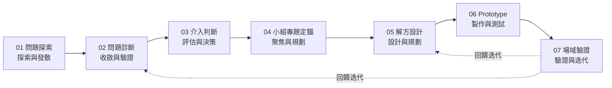

# Capstone 7 階段流程詳細說明

> 問題探索 → 問題診斷 → 介入判斷 → 小組專題定錨 → 解方設計 → Prototype → 場域驗證

## 流程總覽

## 01 問題探索

- **目的**：打開視野，發散問題
- **活動**：場域觀察、田野調查、利害關係人訪談、文獻回顧
- **工具**：觀察記錄表、訪談大綱、同理心地圖
- **產出**：問題清單、田野筆記
- **評量**：問題多元性、觀察深度

## 02 問題診斷

- **目的**：收斂問題，找出根因
- **活動**：問題分類、5 Whys、魚骨圖、數據分析
- **工具**：親和圖、魚骨圖、數據儀表板
- **產出**：問題定義、根因分析報告
- **評量**：診斷邏輯性、證據充分性

## 03 介入判斷

- **目的**：判斷是否值得/能夠介入
- **活動**：可行性評估、資源與限制盤點、風險評估
- **工具**：可行性矩陣、SWOT、風險矩陣
- **產出**：介入方案、評估矩陣
- **評量**：判斷合理性、風險意識

## 04 小組專題定錨

- **目的**：將介入方案轉為可執行專題
- **活動**：題目聚焦、SMART 目標設定、角色分工、時程規劃
- **工具**：專題計畫書模板、甘特圖、RACI 分工表
- **產出**：專題計畫書、甘特圖
- **評量**：目標明確性、計畫完整性

## 05 解方設計

- **目的**：設計具體解決方案
- **活動**：創意發想、方案收斂、系統設計、使用者旅程設計
- **工具**：腦力激盪、SCAMPER、服務藍圖、系統架構圖
- **產出**：設計文件、架構圖
- **評量**：創意性、可行性、使用者中心

## 06 Prototype 原型製作

- **目的**：快速將設計具象化並測試
- **活動**：低/中/高保真原型製作、內部測試、快速迭代
- **工具**：Figma、紙模型、3D 列印、程式原型
- **產出**：Prototype、測試報告、迭代紀錄
- **評量**：原型完整度、迭代速度

## 07 場域驗證

- **目的**：在真實場域驗證成效並迭代
- **活動**：場域實測、使用者回饋蒐集、成效評估、反思
- **工具**：驗證計畫表、回饋問卷、成效指標
- **產出**：驗證報告、迭代建議、成果發表
- **評量**：驗證嚴謹性、反思深度、改進可行性

## 階段轉換檢查點（Gate）

每個階段結束需通過檢查點才能進入下一階段：

| Gate | 檢查項 |
|------|--------|
| G1 探索→診斷 | 是否有足夠多且多元的問題清單？ |
| G2 診斷→介入 | 問題根因是否清晰且有證據？ |
| G3 介入→定錨 | 介入方案是否可行且有資源？ |
| G4 定錨→設計 | 專題目標是否 SMART？分工是否明確？ |
| G5 設計→原型 | 設計是否完整且可製作？ |
| G6 原型→驗證 | 原型是否通過內部測試？ |
| G7 驗證→結案 | 場域驗證是否完成且有反思？ |

## 對應目錄

- `01_問題探索/` → 階段 01
- `02_問題診斷/` → 階段 02
- `03_介入判斷/` → 階段 03
- `04_小組專題定錨/` → 階段 04
- `05_解方設計/` → 階段 05
- `06_Prototype/` → 階段 06
- `07_場域驗證/` → 階段 07
