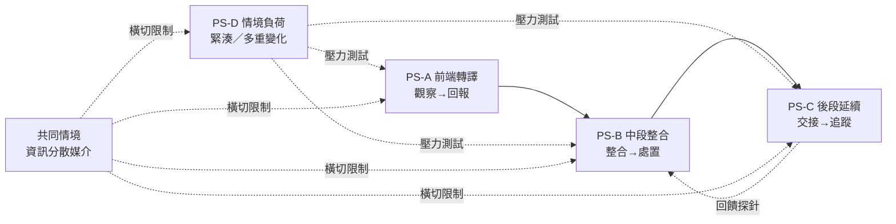

# Output | Project Space Map V1

## Shared Challenge｜（一句話）

> 在 **L2 資訊流與交接層**，為 **照服人員與護理人員** 於 **住民重要變化後「照服觀察回報→護理整合處置→下一班交接」**之過程中，在**工作節奏緊湊、跨班頻繁、資訊分散易遺漏／重複確認**的限制下，設計並驗證使 **重要照護資訊被即時、清楚地承接、整合、確認與延續** 的 **跨角色照護資訊承接與確認機制**。

*來源：`docs/challenge-boundary.md:57`*

---

## Project Space Map V1

| Project Space | 探索核心 | 與其他 PS 的關係 |
|---|---|---|
| **PS-A 前端轉譯** 現場觀察回報的訊息轉譯與完整性 | 照服現場觀察如何被描述與回報，完整度／時效與術語落差如何影響護理整合；聚焦 **觀察→回報→整合** 斷點。*需場域驗證*：回報語句與判定標準一致性。 來源 Lens：**Role + Process + Information** | **上游**：為 PS-B 提供輸入品質；若前端轉譯失效，PS-B 的整合將繼承缺口。 **橫切**：受 **共同情境-資訊分散／節奏緊湊** 影響，需與所有 PS 共同檢視媒介一致性。 **互補**：與 PS-C 形成首尾對照（前端回報 vs 後端交接）。 |
| **PS-B 中段整合** 護理整合與處置的資訊承接 | 護理如何彙整多來源多媒介片段資訊並形成處置，處置依據與後續指示如何被照服承接確認；聚焦 **回報→整合→處置** 承接迴路。*需場域驗證*：彙整方式與確認路徑。 來源 Lens：**Process + Coordination + Information** | **中樞**：承接 PS-A 的回報，輸出至 PS-C 的交接；是資訊由分散到收斂的關鍵樞紐。 **橫切**：同樣受資訊分散與節奏影響，與 PS-D 的優先排序情境交織（多事件並發時整合壓力更大）。 **互補**：與 PS-A/PS-C 構成「前端—中段—後段」完整鏈。 |
| **PS-C 後段延續** 跨班交接的確認、延續與追蹤 （含 PS-6 追蹤迴路） | 當班處置後到下一班如何確認已承接／需延續，認知不一致與遺漏／重複確認的時點成因；延伸追蹤回饋是否形成迴路。*需場域驗證*：交接形式與確認樣態。 來源 Lens：**Coordination + Scenario + Process** | **下游**：為前段成果的「延續性」把關，若無有效確認，A/B 成果無法延續。 **整合 PS-6**：原備選的追蹤迴路改為本空間的延伸探針，僅在場域證實存在迴路時展開。 **橫切**：與 PS-D 的跨班頻繁限制直接相關，與 PS-A 形成流程閉環對照。 |
| **PS-D 情境負荷** 緊湊節奏與多重變化下的優先與協調 | 緊湊節奏、同時多位住民變化或人力緊繃時如何排序與分配注意力，協調行為（追問／複誦等）被省略的後果。*需場域驗證*：緊湊樣態與省略發生率。 來源 Lens：**Scenario + Coordination（主）+ Role** | **正交情境**：非流程階段，而是**疊加於 A/B/C 之上的情境變異層**；可選「常態」或「尖峰」作為 A/B/C 的情境切片，形成 4×2 驗證矩陣。 **放大器**：會放大 A/B/C 的既有斷點（尖峰時遺漏更易發生），提供壓力測試視角。 **互補**：與共同情境共同構成限制層檢核。 |

### 跨 PS 共同情境（原 PS-4 轉化，不獨立立題）

- **資訊分散於不同媒介**：所有 PS（A/B/C/D）在場域驗證時皆須盤點實際媒介、比對一致性落差與更新時機，作為機制設計的共同限制條件，而非獨立專題。

---

## 關係圖

- **縱向**：A→B→C 為「住民重要變化後」時間鏈，資訊由產生到延續
- **橫向**：E（媒介分散）為橫切資訊層限制，D（節奏負荷）為橫切情境層限制
- **迴路**：C 的追蹤探針可回饋至 B，形成延續性閉環（需場域證實）

---

## 邊界與探索說明

- **皆位於 Challenge Boundary 內**：L2、照服↔護理、指定情境、聚焦承接／整合／確認／延續，未提解方
- **保留探索空間**：每組皆含「需場域驗證」，對應 01 問題探索→02 診斷→03 介入判斷→04 定錨→05 解方設計→06 Prototype→07 場域驗證
- **教學操作**：建議 4 組各 1–2 小組認領，02 診斷時以本 Map 進行跨組對照，04 定錨以 Shared Challenge 為 Gate
